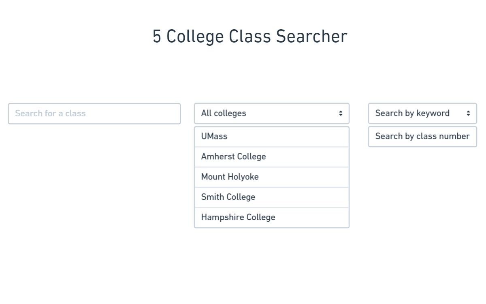
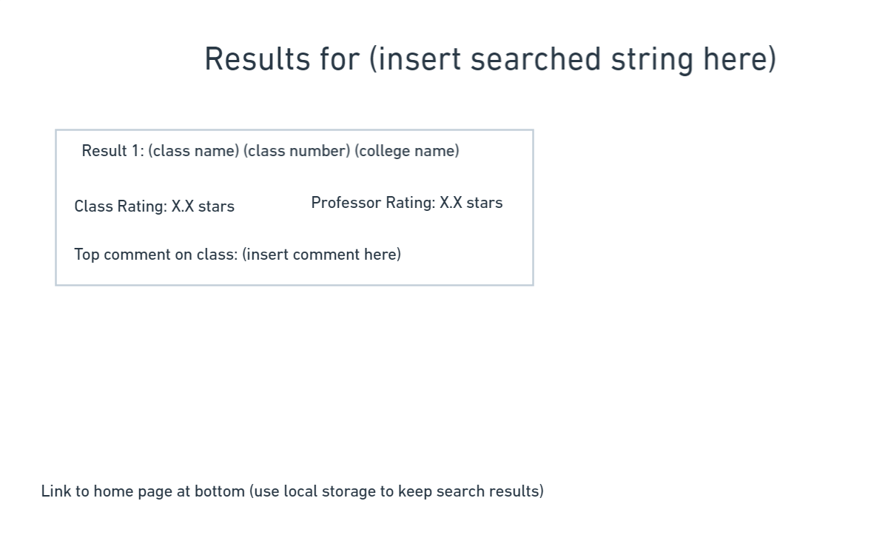
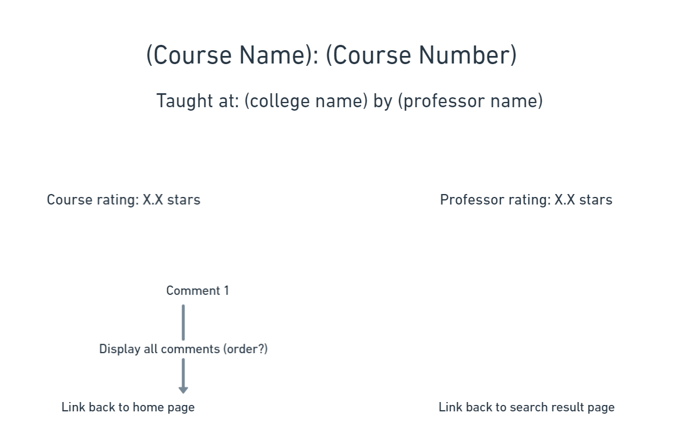

Our interactions between the users and data have not changed, they will be as follows:

1. A scraper to collect course and professor data
2. A search feature to search through the scraped data
3. A star-based rating system for users to leave rating feedback
4. A comment section for users to discuss the classes they've taken and why they liked or didn't like them

