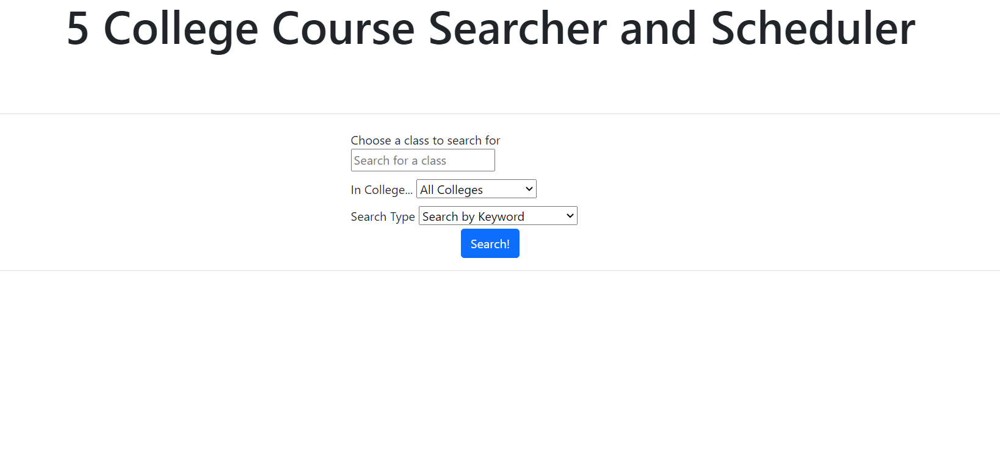

API:
    GET /getCourses
        Parameters: None
        Description: Returns all the courses saved under courses.json

    POST /createCourse
        Parameters: {class-name: sampleClass, school: UMass, instructor: Emery Berger, time: 100}
        Description: Creates a new course with the params and writes it to courses.json
    
    POST /reset
        Parameters: None
        Description: Deletes all the courses saved so far and resets

Division of Labor:
    Thant Kyaw Hset:
        Implemented all the POST APIs
        Wrote milestone2.md

    Timothy Dalton:
        Implemented all the GET APIs
        Wrote the search backend for results.js

        
        
        
        
